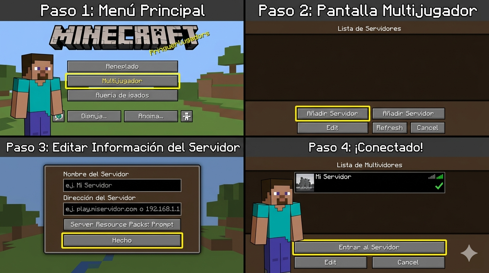
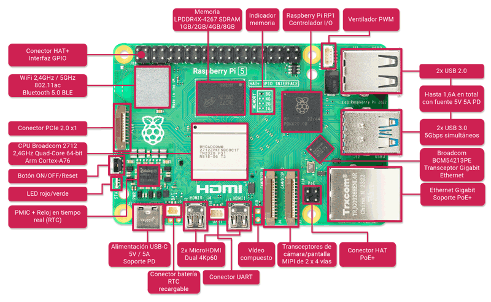
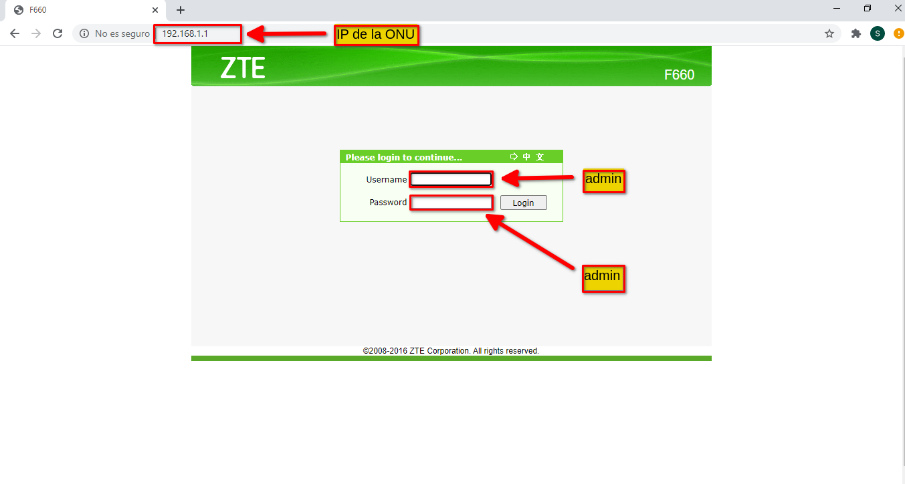

# servidor-minecraft-raspberry
Manual del usuario. Proyecto Servidor Minecraft

# 🖥️ Servidor de Minecraft en Raspberry Pi

Este proyecto consiste en un servidor de Minecraft configurado en una Raspberry Pi, diseñado para que cualquier usuario pueda utilizarlo sin necesidad de conocimientos técnicos.

---

##  Manual de usuario

### 1. Contenido del producto

Al adquirir el servidor, se incluye:

- Raspberry Pi configurada como servidor de Minecraft  
- Tarjeta microSD con el sistema instalado  
- Fuente de alimentación  
- Guía básica de uso  

El servidor ya viene listo para funcionar, por lo que no es necesario instalar nada adicional.

---

### 2. 2. Puesta en marcha
En esta sección se describen los pasos que debes seguir para preparar tu entorno doméstico e instalar las herramientas necesarias en tu ordenador antes de proceder a iniciar el servidor o conectarte al juego.

Nota para el lector: Este documento funciona exclusivamente como un Manual de Usuario enfocado en la operación práctica. Si deseas consultar los detalles técnicos del despliegue, comandos avanzados o el proceso completo de configuración desde cero, por favor remítete a la Guía de Implementación, donde se encuentra toda la documentación técnica detallada de forma exhaustiva.

2.1. Conexión física del hardware
El dispositivo se entrega completamente configurado dentro de su carcasa de protección. Para encenderlo por primera vez, sigue estos pasos:

Conecta un cable de red Ethernet desde cualquiera de los puertos LAN libres de tu router doméstico al puerto Ethernet de la Raspberry Pi. Esto garantizará la máxima estabilidad y velocidad para el servidor.
    * Para conectar tu Raspberry Pi a una red cableada, inserta un cable Ethernet en el puerto Ethernet de tu Raspberry Pi hasta que oigas un clic. Si tu modelo de       Raspberry Pi no incluye un puerto Ethernet, puedes usar un adaptador Ethernet USB.
      

Conecte el otro extremo del cable a un puerto de su concentrador, conmutador o enrutador de red. Raspberry Pi OS se conectará automáticamente a la red.

Para extraer el cable Ethernet, presione el clip situado en la parte inferior del conector y deslice suavemente el cable para extraerlo del puerto.

Conecta el cable de la fuente de alimentación oficial al puerto USB-C de la Raspberry Pi y enchúfalo a la toma de corriente. El dispositivo se iniciará de forma automática.

En la parte trasera de la carcasa encontrarás una etiqueta adherida con la Dirección IP Local fija que tiene asignada el dispositivo (por ejemplo: 192.168.1.50).

Nota: Esta dirección IP es estrictamente local. Solo funcionará para los ordenadores y dispositivos que estén conectados al mismo Wi-Fi o router de tu casa.

2.2. Instalación de herramientas de administración remota (SSH)
Para poder gestionar el servidor en el futuro (por ejemplo, para mandarle comandos o apagarlo de forma segura sin dañar el sistema operativo), necesitas tener preparado un cliente SSH en tu ordenador habitual. Dependiendo de tu sistema operativo, realiza la siguiente preparación:

Si utilizas Windows (Instalación de PuTTY):

Abre tu navegador web y descarga el instalador oficial de PuTTY desde su página web (https://www.putty.org/).

Ejecuta el archivo descargado y sigue el asistente de instalación dejando las opciones que vienen por defecto.

Una vez finalizado el proceso, ya tendrás la herramienta disponible en el menú de inicio de Windows para cuando necesites usarla en los siguientes apartados.

Si utilizas Linux (Uso de la Terminal nativa):
No necesitas instalar ningún software adicional. Los sistemas operativos basados en Linux cuentan con un cliente SSH integrado directamente en el sistema.

Simplemente localiza y abre la aplicación Terminal (puedes usar el atajo rápido Ctrl + Alt + T).

Mantén la ventana abierta para comprobar que responde correctamente a los comandos.

---

### 3. Cómo conectarse al servidor
1. Abrir Minecraft  
2. Acceder a “Multijugador”  
3. Seleccionar “Añadir servidor”  
4. Introducir la dirección IP  
5. Conectarse
   
#### Paso 1: Obtener la dirección IP

La dirección IP se puede consultar:

- En la etiqueta del dispositivo  
- Desde la configuración del router
  Pasos:
Abrir el navegador web
Acceder al router escribiendo en la barra de direcciones:
192.168.1.1
Iniciar sesión con el usuario y contraseña del router
(suelen estar en una pegatina del propio router)
Buscar una sección como:
“Dispositivos conectados”
“Clientes DHCP”
“Lista de dispositivos”
Localizar la Raspberry Pi en la lista
(suele aparecer como “raspberrypi” o similar)
Anotar la dirección IP asignada
(ejemplo: 192.168.1.123)

## Acceso desde fuera de la red (conexión remota)

Para conectarse al servidor desde fuera de la red local, es necesario configurar el router.

1. Acceder al router (normalmente 192.168.1.1 en el navegador)
2. Buscar la opción de “Port Forwarding” o “Redirección de puertos”
3. Añadir una nueva regla:
   - Puerto: 25565
   - IP: dirección IP local de la Raspberry Pi
   - Protocolo: TCP
4. Guardar los cambios

Una vez hecho esto, los jugadores podrán conectarse utilizando la IP pública de la red.
 

🔐 Acceso remoto alternativo con Tailscale

En caso de no poder configurar el router o abrir puertos, se puede utilizar Tailscale como alternativa para acceder al servidor de forma remota.

Tailscale permite conectar dispositivos como si estuvieran en la misma red local, sin necesidad de abrir puertos.

Instalación en la Raspberry Pi
Abrir una terminal en la Raspberry Pi
Ejecutar el siguiente comando:

curl -fsSL https://tailscale.com/install.sh | sh

3. Iniciar Tailscale:
   sudo tailscale up

4. Se mostrará un enlace. Ábrelo en el navegador e inicia sesión con tu cuenta (Google, GitHub, etc.)

📱 Acceso desde dispositivos con Tailscale

Además de instalar Tailscale en la Raspberry Pi, es necesario instalarlo en el dispositivo desde el que te vas a conectar (ordenador o móvil).

Instalación en ordenador
Ir a la página oficial:
👉 https://tailscale.com/download
Descargar la versión correspondiente (Windows, macOS o Linux)
Instalar el programa
Iniciar sesión con la misma cuenta utilizada en la Raspberry Pi
Instalación en móvil
Abrir la tienda de aplicaciones:
Android → Google Play
iPhone → App Store
Buscar: Tailscale
Instalar la aplicación
Iniciar sesión con la misma cuenta

- Cómo conectarse al servidor

Una vez que Tailscale esté activo en todos los dispositivos:

Abrir la aplicación de Tailscale
Ver la lista de dispositivos conectados
Localizar la Raspberry Pi
Copiar su dirección IP (formato 100.x.x.x)
Uso en Minecraft
Abrir Minecraft
Ir a “Multijugador”
Añadir servidor
Introducir la IP de Tailscale de la Raspberry Pi
Conectarse

Con Tailscale, el servidor funciona como si estuviera en la misma red, aunque estés en otra ubicación, sin necesidad de configurar el router.

---

### 4. Uso del servidor

Una vez conectado, el usuario puede:

- Crear mundos y jugar con otros jugadores  
- Construir y explorar  
- Invitar a otros usuarios  

El funcionamiento es el mismo que cualquier servidor de Minecraft.

---

### 5. Recomendaciones de uso

Para un funcionamiento óptimo:

- No superar los 8-10 jugadores simultáneos  
- No instalar modificaciones sin conocimientos previos  
- Apagar el dispositivo cuando no se utilice  

---

### 6. Apagado del servidor

Para evitar errores, no se debe desconectar directamente.

Se recomienda:

- Acceder al sistema

Para evitar errores, no se debe desconectar directamente el dispositivo.

Para apagar el servidor correctamente:

1. Acceder al sistema desde un ordenador:
   - Usar SSH (por ejemplo con el programa PuTTY en Windows)
   - Introducir la IP de la Raspberry Pi

2. Una vez dentro, ejecutar:
   stop

3. Después apagar el sistema con:
   sudo shutdown now

En caso de no poder acceder, se puede desconectar, aunque no es lo recomendable.
 
- Apagar la Raspberry Pi (En el último caso)

---

### 7. Problemas comunes

**No se puede conectar:**

- Verificar que la Raspberry Pi está encendida  
- Comprobar la dirección IP  
- Revisar la conexión a internet  

**El servidor funciona lento:**

- Reducir el número de jugadores  
- Reiniciar el sistema  

---

### 8. Mantenimiento

Para mantener el servidor en buen estado:

- Reiniciar el sistema periódicamente  
- Evitar apagados bruscos  
- Mantener el dispositivo bien ventilado  

---

### 9. Soporte

En caso de problemas técnicos, se recomienda contactar con el proveedor del servidor.

---
10. ## 🖼️ Ejemplos visuales

## Como agregar el servidor Minecraft

## Información de la Raspberry

## Como ingresar al router

##  Autor

Juan Gerardo González Santos

---

##  Nota

Este servidor está pensado para grupos pequeños de jugadores, debido a las limitaciones de la Raspberry Pi.
